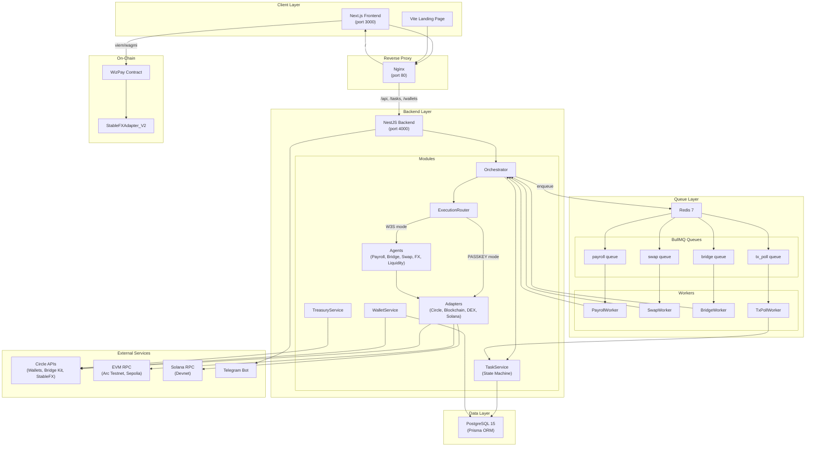
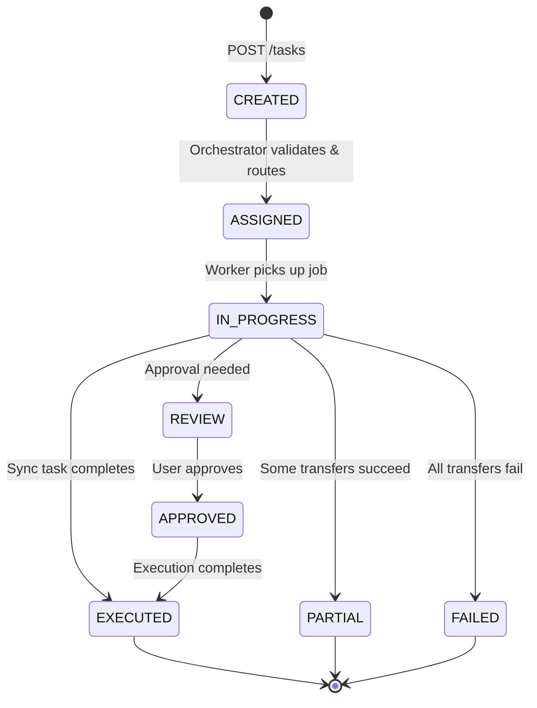
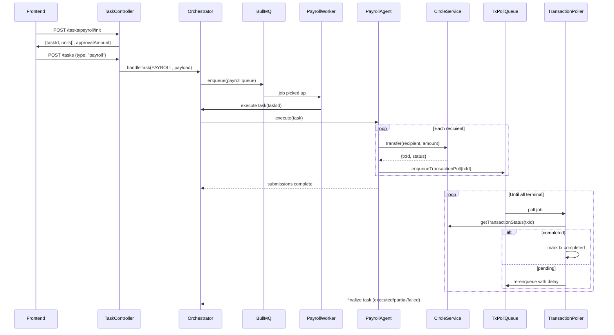
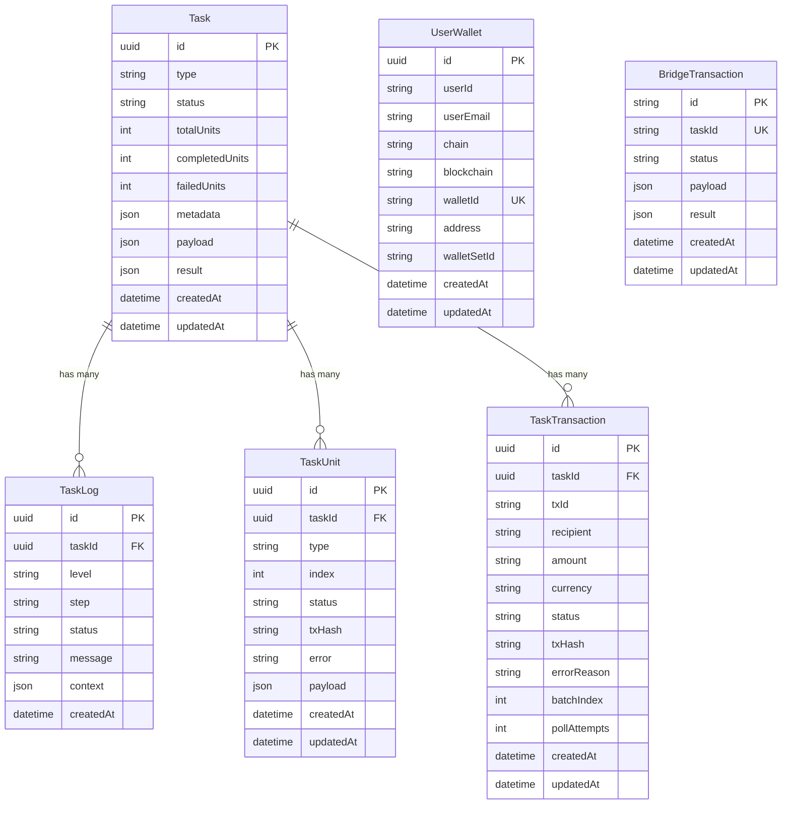
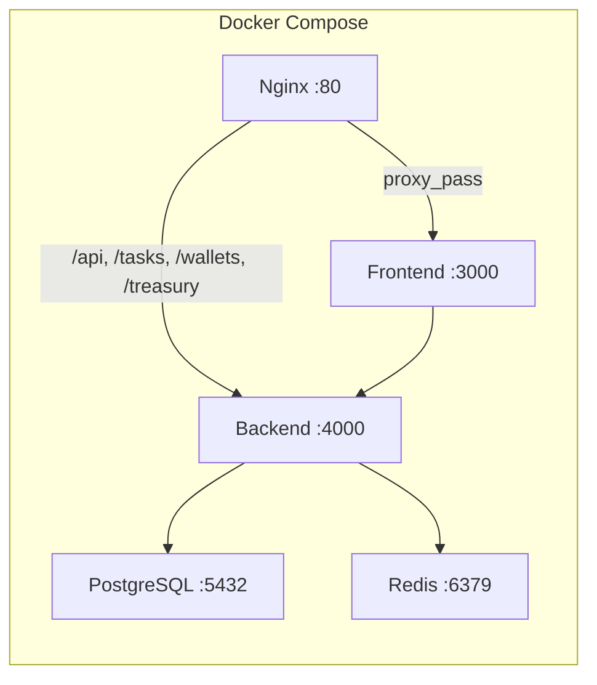
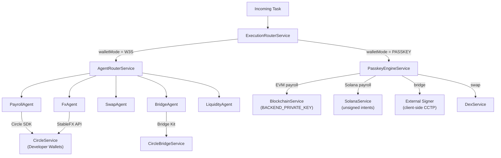

# WizPay — Comprehensive Codebase Analysis

> **Tanggal Analisis:** 3 Mei 2026  
> **Repo:** `wizpay-core` (monorepo)  
> **Stack:** NestJS · Next.js · Solidity (Foundry) · PostgreSQL · Redis/BullMQ · Circle APIs · Docker

---

## 1. Executive Summary

WizPay adalah platform **Web3 payroll & payment router** yang memungkinkan perusahaan melakukan pembayaran gaji karyawan secara batch menggunakan stablecoin (USDC/EURC) di multi-chain (Arc Testnet, Ethereum Sepolia, Solana Devnet). Sistem ini mengintegrasikan **Circle Programmable Wallets**, **CCTP V2 cross-chain bridge**, **StableFX** untuk forex stablecoin, dan **smart contract on-chain** untuk atomic cross-token payment routing.

---

## 2. Repo Structure — Monorepo Layout

```
wizpay-core/
├── package.json                 # Root — npm workspaces config
├── docker-compose.yml           # Production orchestration (4 services)
├── docker-compose.dev.yml       # Development overrides
├── docker-compose.prod.yml      # Production overrides
├── nginx.conf                   # Reverse proxy config
├── .env.example                 # Root environment template (92 vars)
├── split_circle_provider.py     # Utility script
│
├── apps/
│   ├── backend/                 # NestJS API server (port 4000)
│   │   ├── Dockerfile
│   │   ├── package.json         # 14 deps + 20 devDeps
│   │   ├── prisma.config.ts
│   │   └── src/
│   │       ├── main.ts          # Bootstrap + CORS
│   │       ├── app.module.ts    # Root module (10 sub-modules)
│   │       ├── adapters/        # External service integrations
│   │       ├── agents/          # Task execution agents
│   │       ├── common/          # Shared utilities
│   │       ├── config/          # App configuration
│   │       ├── database/        # Prisma ORM + schema
│   │       ├── execution/       # Wallet execution routing
│   │       ├── integrations/    # Telegram notifications
│   │       ├── modules/wallet/  # User wallet management
│   │       ├── orchestrator/    # Task orchestration + HTTP API
│   │       ├── queue/           # BullMQ queues + workers
│   │       ├── task/            # Task state machine + services
│   │       └── treasury/        # Treasury wallet management
│   │
│   ├── frontend/                # Next.js 15 dashboard (port 3000)
│   │   ├── Dockerfile
│   │   ├── package.json         # 30 deps (Circle SDK, wagmi, viem)
│   │   ├── app/                 # Pages (App Router)
│   │   ├── components/          # UI components (dashboard, providers, ui)
│   │   ├── constants/           # ABIs, addresses
│   │   ├── hooks/               # React hooks (20+ custom hooks)
│   │   ├── lib/                 # Utilities (API client, bridge, swap, fx)
│   │   └── services/            # Circle auth services
│   │
│   └── landing/                 # Vite + React landing page
│       ├── package.json
│       ├── index.html
│       └── src/
│
└── packages/
    └── contracts/               # Solidity smart contracts (Foundry)
        ├── foundry.toml
        ├── src/
        │   ├── WizPay.sol           # Main payment router contract
        │   ├── StableFXAdapter_V2.sol # DEX/LP adapter (SFX-LP token)
        │   ├── IFXEngine.sol        # FX engine interface
        │   ├── IERC20.sol           # ERC20 interface
        │   └── IPermit2.sol         # Permit2 interface
        ├── scripts/             # Rate update & payment flow scripts
        ├── test/                # Foundry tests
        └── deployments/         # Deployment artifacts
```

> [!IMPORTANT]
> **Tipe Repo:** Monorepo menggunakan **npm workspaces** (`"workspaces": ["apps/*", "packages/*"]`). Bukan turborepo/nx — hanya native npm workspaces.

---

## 3. Modularitas Assessment

### ✅ Backend — Highly Modular (NestJS Module Pattern)

Root `AppModule` mengimpor **10 sub-module** yang masing-masing self-contained:

| Module | File Count | Responsibility |
|--------|-----------|----------------|
| `AppConfigModule` | 3 | Env validation, configuration |
| `DatabaseModule` | 3 | Prisma client, schema, migrations |
| `AdaptersModule` | 8 | Circle API, blockchain RPC, DEX, Solana |
| `AgentsModule` | 11 | Payroll, Bridge, Swap, FX, Liquidity agents |
| `IntegrationsModule` | 3 | Telegram notifications |
| `TaskModule` | 10 | Task CRUD, state machine, logs, transactions |
| `QueueModule` | 12 | BullMQ queues, workers, processors |
| `OrchestratorModule` | 3 | Task routing, orchestration, HTTP controller |
| `TreasuryModule` | 3 | Treasury wallet config & balance |
| `WalletModule` | 4 | User wallet provisioning (W3S + passkey) |

### ✅ Frontend — Component-Based (Next.js App Router)

Organisasi modular dengan separation of concerns:
- **`app/`** — Route pages (dashboard, bridge, swap, send, liquidity, assets)
- **`components/dashboard/`** — Feature components (30+ files)
- **`components/providers/`** — Context providers (Circle, Hybrid, API proxy)
- **`components/ui/`** — Reusable primitives (15 shadcn/ui components)
- **`hooks/`** — 20+ custom React hooks
- **`lib/`** — Business logic utilities (18 files)
- **`services/`** — Circle authentication services

### ✅ Smart Contracts — Clean Separation

- `WizPay.sol` — Payment router (main contract)
- `StableFXAdapter_V2.sol` — LP/DEX adapter (implements `IFXEngine`)
- Interfaces cleanly separated (`IFXEngine`, `IERC20`, `IPermit2`)

---

## 4. System Architecture



---

## 5. Business Design & Konsep

### 5.1 Core Value Proposition

WizPay menyelesaikan masalah **pembayaran gaji crypto** dengan fitur:

1. **Batch Payroll** — Bayar banyak karyawan dalam 1 transaksi atomik
2. **Cross-Token Payment** — Bayar dengan USDC, karyawan terima EURC (atau sebaliknya)
3. **Multi-Chain** — Arc Testnet, Ethereum Sepolia, Solana Devnet
4. **Cross-Chain Bridge** — Transfer USDC antar chain via Circle CCTP V2
5. **StableFX** — Forex stablecoin (USDC ↔ EURC) via Circle StableFX API
6. **Non-Custodial** — Smart contract tidak menyimpan dana user

### 5.2 User Personas & Wallet Modes

| Mode | Auth Method | Wallet Type | Use Case |
|------|------------|-------------|----------|
| **W3S** | Google/Email | Circle Developer-Controlled | Enterprise payroll (backend signs) |
| **PASSKEY** | WebAuthn Passkey | Circle Modular AA Wallet | Individual user (client signs) |
| **External** | MetaMask/RainbowKit | EOA via wagmi | DeFi-native users |

### 5.3 Revenue Model

- **Fee Collection** — WizPay contract charges 0–1% fee (configurable, max 100 bps)
- **LP Fees** — StableFXAdapter charges 0.25% swap fee, distributed to LP providers
- **SFX-LP Token** — Liquidity providers earn proportional share of swap fees

---

## 6. Task Orchestration Workflow



### Task Types & Queue Routing

| TaskType | Queue | Agent | Async? |
|----------|-------|-------|--------|
| `payroll` | `payroll` | PayrollAgent | ✅ (poll via tx_poll) |
| `swap` | `swap` | SwapAgent | ❌ |
| `bridge` | `bridge` | BridgeAgent | ❌ |
| `liquidity` | `swap` | LiquidityAgent | ❌ |
| `fx` | `swap` | FxAgent | ❌ |

### Payroll Execution Flow



---

## 7. Database Schema (Prisma)



**6 Models Total:** Task, TaskLog, TaskUnit, TaskTransaction, UserWallet, BridgeTransaction

---

## 8. Smart Contract Architecture

### WizPay.sol — Payment Router

**Inheritance:** `Ownable` + `Pausable` + `ReentrancyGuard`

| Function | Description |
|----------|-------------|
| `routeAndPay()` | Single payment: tokenIn → FXEngine → tokenOut → recipient |
| `batchRouteAndPay()` (uniform) | Batch: same tokenOut for all recipients |
| `batchRouteAndPay()` (mixed) | Batch: different tokenOut per recipient |
| `getEstimatedOutput()` | Quote estimation (view) |
| `getBatchEstimatedOutputs()` | Batch quote (view) |
| `emergencyWithdraw()` | Rescue stuck tokens (owner only) |

**Security Features:**
- Token whitelist (optional)
- Max fee cap: 1% (100 bps)
- Reentrancy guard on all payment functions
- Emergency pause mechanism
- Max batch size: 50 recipients

### StableFXAdapter_V2.sol — LP/DEX

**Inheritance:** `IFXEngine` + `ERC20("SFX-LP")` + `Ownable`

| Feature | Detail |
|---------|--------|
| LP Token | SFX-LP (6 decimals, ERC20) |
| Swap Fee | 0.25% (stays in pool, increases TVL) |
| Oracle | Owner-set exchange rates with 1-year validity |
| Multi-decimal | Auto-adjusts for 6 vs 18 decimal tokens |
| TVL Calculation | Cross-token normalized to baseAsset |

---

## 9. Frontend Architecture

### Provider Stack (outermost → innermost)

```
QueryClientProvider (TanStack Query)
  └── WagmiProvider (wagmi config)
       └── RainbowKitProvider (wallet connection)
            └── CircleWalletProvider (W3S SDK)
                 └── HybridWalletProvider (mode toggle)
                      └── CircleApiProxyProvider (API proxy)
                           └── {children}
```

### Pages & Routes

| Route | Component | Purpose |
|-------|-----------|---------|
| `/` | `page.tsx` | Main dashboard (overview, batch composer) |
| `/bridge` | `BridgeScreen` | Cross-chain USDC bridge |
| `/swap` | `SwapScreen` | Token swap |
| `/send` | Send page | Direct transfer |
| `/liquidity` | `LiquidityScreen` | LP management |
| `/assets` | Assets page | Portfolio view |
| `/dashboard` | Redirect → `/` | Legacy redirect |

### Key Frontend Libraries

| Library | Purpose |
|---------|---------|
| `wagmi` + `viem` | EVM wallet interaction |
| `@rainbow-me/rainbowkit` | Wallet connection UI |
| `@circle-fin/w3s-pw-web-sdk` | Circle W3S wallet |
| `@circle-fin/app-kit` | Circle modular wallets |
| `@circle-fin/swap-kit` | Circle swap |
| `@tanstack/react-query` | Server state management |
| `recharts` | Dashboard charts |
| `shadcn/ui` + `radix-ui` | UI component library |
| `tailwindcss` v4 | Styling |

---

## 10. Infrastructure & Deployment

### Docker Services



| Service | Image | Health Check | Restart |
|---------|-------|-------------|---------|
| backend | Custom Dockerfile | `wget http://localhost:4000/` | `unless-stopped` |
| frontend | Custom Dockerfile | `wget http://localhost:3000/` | `unless-stopped` |
| postgres | `postgres:15` | `pg_isready` | `always` |
| redis | `redis:7-alpine` | — | `unless-stopped` |

### Environment Variables (92 total in `.env.example`)

| Category | Count | Examples |
|----------|-------|---------|
| Database/Cache | 6 | `DATABASE_URL`, `REDIS_HOST` |
| Circle Server | 6 | `CIRCLE_API_KEY`, `CIRCLE_ENTITY_SECRET` |
| Treasury Wallets | 9 | `CIRCLE_WALLET_ID_ARC`, `_SEPOLIA`, `_SOLANA` |
| Transfer Config | 3 | `CIRCLE_TRANSFER_BLOCKCHAIN`, `_FEE_LEVEL` |
| Frontend Public | 8 | `NEXT_PUBLIC_API_URL`, `_CIRCLE_APP_ID` |
| Feature Flags | 2 | `WIZPAY_BRIDGE_EXTERNAL_ENABLED` |
| RPC URLs | 3 | `RPC_URL`, `SOLANA_DEVNET_RPC_URL` |

---

## 11. Multi-Chain Support Matrix

| Chain | Chain ID | Type | Wallet Modes | Features |
|-------|----------|------|-------------|----------|
| Arc Testnet | 5042002 | EVM | W3S, Passkey, External | Payroll, Swap, Bridge, FX |
| Eth Sepolia | 11155111 | EVM | W3S, Passkey, External | Payroll, Bridge |
| Solana Devnet | — | Solana | W3S (limited), Passkey (intent-only) | Payroll (client-sign), Bridge |

### Bridge Support (CCTP V2)

```
Arc Testnet ↔ Eth Sepolia     ✅ (USDC only)
Arc Testnet ↔ Solana Devnet   ✅ (USDC only)
Eth Sepolia ↔ Solana Devnet   ✅ (USDC only)
```

---

## 12. Execution Engine — Dual Mode



**W3S Mode:** Backend controls wallet signing via Circle SDK + entity secret  
**PASSKEY Mode:** Backend either signs with treasury key (EVM) or returns unsigned intents (Solana)

---

## 13. API Endpoints

| Method | Path | Handler | Description |
|--------|------|---------|-------------|
| `POST` | `/tasks` | `createTask` | Create & enqueue any task |
| `GET` | `/tasks` | `listTasks` | List with filters (type, status, wallet) |
| `GET` | `/tasks/:id` | `getTask` | Poll task status |
| `POST` | `/tasks/payroll/init` | `initPayroll` | Validate & batch payroll |
| `POST` | `/tasks/swap/init` | `initSwap` | Create swap task |
| `POST` | `/tasks/liquidity/init` | `initLiquidity` | Create liquidity task |
| `POST` | `/tasks/fx/quote` | `quoteFx` | Get StableFX quote |
| `POST` | `/tasks/fx/execute` | `executeFx` | Execute FX trade |
| `POST` | `/tasks/:taskId/units/:unitId/report` | `reportTaskUnit` | Report unit status |
| `POST` | `/wallets/initialize` | W3S wallet init | — |
| `POST` | `/wallets/sync` | Sync upstream wallets | — |
| `GET` | `/treasury/:blockchain` | Get treasury wallet | — |

---

## 14. Key Design Patterns

| Pattern | Where | Description |
|---------|-------|-------------|
| **Agent Pattern** | `agents/` | Each task type has a dedicated agent with `execute()` |
| **Orchestrator** | `orchestrator/` | Central task coordinator (create → enqueue → execute) |
| **State Machine** | `task.service.ts` | Strict status transitions with allowed-transitions map |
| **Queue-Worker** | `queue/` | BullMQ queues with dedicated workers per task type |
| **Adapter Pattern** | `adapters/` | External services wrapped in injectable adapters |
| **Execution Router** | `execution/` | Strategy pattern for W3S vs PASSKEY wallet modes |
| **Provider Stack** | Frontend | Nested React context providers for dependency injection |
| **Feature Flags** | `.env` | Kill-switch for external bridge (`WIZPAY_BRIDGE_EXTERNAL_ENABLED`) |

---

## 15. Observability & Notifications

- **Task Logs** — Every step logged to `TaskLog` table with step name, status, message, context JSON
- **Telegram** — `TelegramService` sends notifications on task status changes
- **Structured Logging** — NestJS `Logger` with context prefixes (`[orchestrator]`, `[bridge]`, etc.)
- **Transaction Tracking** — Per-recipient `TaskTransaction` records with poll attempt counting

---

## 16. Temuan & Catatan Penting

> [!NOTE]
> **Monorepo tanpa Build Orchestrator** — Menggunakan npm workspaces sederhana tanpa Turborepo/Nx. Cukup untuk skala saat ini tapi scaling ke banyak packages akan butuh build caching.

> [!WARNING]
> **Solana Passkey Limitation** — Passkey AA wallets hanya EVM. Solana payroll mengembalikan unsigned intents yang harus di-sign client-side.

> [!IMPORTANT]
> **Dual Circle Integration** — Backend punya DUA Circle client path: `CircleService` (developer-controlled wallets SDK) dan `CircleAdapter/CircleClient` (treasury management). Perlu hati-hati agar tidak duplikasi.

> [!TIP]
> **Smart Contract Non-Custodial** — WizPay.sol menggunakan `transferFrom` pattern — user approve dulu, contract pull token, swap via FXEngine, kirim ke recipient. Tidak menyimpan dana.

---

## 17. Technology Stack Summary

| Layer | Technology | Version |
|-------|-----------|---------|
| **Language** | TypeScript, Solidity | TS 5.x, Sol ^0.8.20 |
| **Backend Framework** | NestJS | v11 |
| **Frontend Framework** | Next.js (App Router) | v15 |
| **Landing Page** | Vite + React | Vite 8, React 19 |
| **ORM** | Prisma | v7.8 |
| **Database** | PostgreSQL | 15 |
| **Queue** | BullMQ + Redis | BullMQ 5.x, Redis 7 |
| **Smart Contracts** | Foundry + OpenZeppelin | OZ 5.x |
| **Wallet SDK** | Circle W3S, Circle Modular | Latest |
| **Bridge** | Circle Bridge Kit (CCTP V2) | v1.8 |
| **EVM Client** | viem + wagmi | viem 2.x, wagmi 2.x |
| **UI** | Tailwind CSS v4, shadcn/ui, Radix | Latest |
| **Auth** | Google OAuth, Email OTP, WebAuthn Passkey | — |
| **Containerization** | Docker + Docker Compose | — |
| **Reverse Proxy** | Nginx | — |
